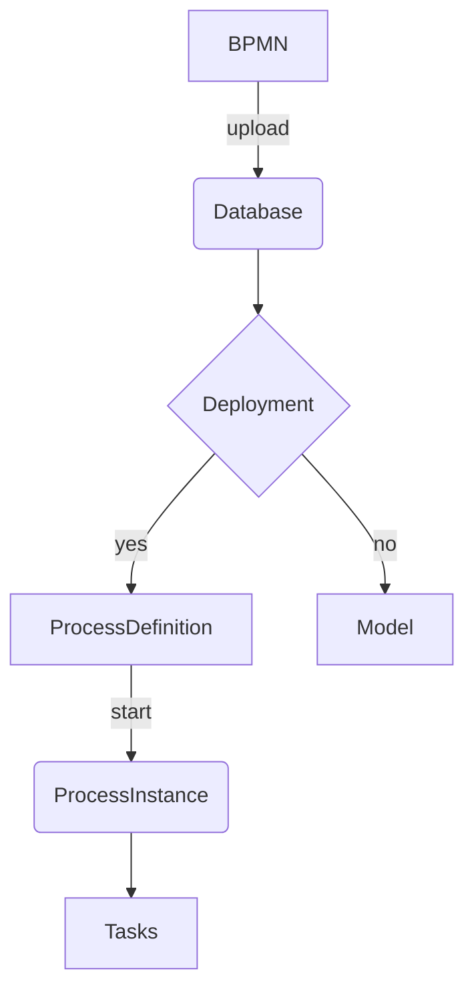

# activiti 7.1.0-M17 整合 SpringBoot 2.6.3

> web根路径为bpmn在线编辑器

### 流程
1. 在线编辑BPMN并保存到数据库
2. 查询BPMN模型列表
3. 部署指定模型为流程定义
4. 启动流程实例并设置参数
5. 查询流程实例列表
6. 查询流程实例历史

```mermaid
graph TD
    A[BPMN] -->|upload| B(Database)
    B --> C{Deployment}
    C -->|yes| D[ProcessDefinition]
    C -->|no| E[Model]
    D --> |start| F(ProcessInstance) --> G[Tasks]
```
